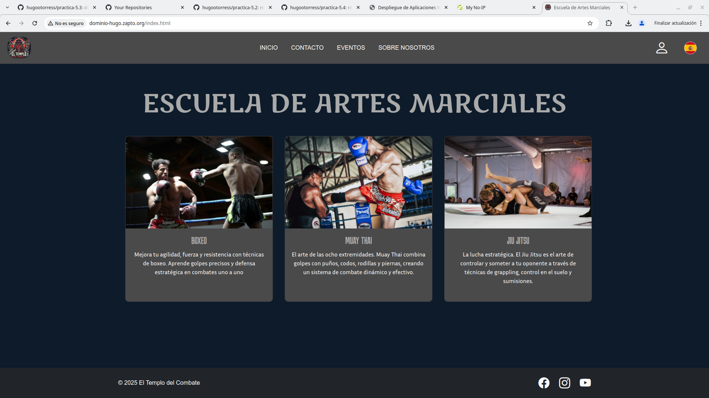

# Practica 5.3:Despliegue de Frontend con Docker y HTTPS
Esta práctica tiene como objetivo desplegar una aplicación frontend utilizando Docker y HTTPS

## Requisitos previos
- Tener la carpeta con los archivos de tu frontend en tu ubicación
- Tener docker y docker compose instalado

## Pasos
### Dockerfile
Primero creamos el Dockerfile.Este define cómo crear una imagen de Docker para el servicio `frontend`. Se utiliza la imagen base de Nginx en Alpine Linux, y se copian los archivos del frontend en la carpeta adecuada para que Nginx los sirva.
```bash
# Usar imagen de Nginx 
FROM nginx:alpine

# Copiar los archivos de mi frontend
COPY ./frontend /usr/share/nginx/html

# Exponer el puerto 80 para tráfico HTTP
EXPOSE 80 
```
### .env
Creamos nuestro archivo .env en el cual almacenamos nuestro dominio hecho con no-ip.Por ejemplo:
```bash
DOMINIO=tu-dominio.com
```

### docker-compose.yml
Como segundo paso creamos nuestro archivo docker-compose.yml.Este define los servicios de la aplicación:
- frontend: Sirve los archivos del frontend.
- nginx-proxy: Se encarga de manejar el tráfico HTTPS y el dominio utilizando Nginx.
- certbot: Utiliza Certbot para obtener y renovar los certificados SSL.
```bash
version: '3.7'

services:
  frontend:
    build: .
    container_name: frontend
    restart: always
    volumes:
      - ./frontend:/usr/share/nginx/html
    ports:
      - "80:80"
    networks:
      - frontend-network
    environment:
      - DOMINIO=${DOMINIO}  

  nginx-proxy:
    image: jwilder/nginx-proxy
    container_name: nginx-proxy
    environment:
      - DEFAULT_HOST=${DOMINIO}  
    ports:
      - "443:443"
    volumes:
      - /var/run/docker.sock:/tmp/docker.sock:ro
    networks:
      - frontend-network

  certbot:
    image: certbot/certbot
    container_name: certbot
    volumes:
      - ./data/certbot/conf:/etc/letsencrypt
      - ./data/certbot/www:/var/www/certbot
    networks:
      - frontend-network
    environment:
      - DOMINIO=${DOMINIO}  
    entrypoint: "/bin/sh -c 'trap exit TERM; while :; do certbot renew; sleep 12h & wait $${!}; done;'"

networks:
  frontend-network:
    driver: bridge
```

### Lanzar el contenedor
- Construimos el servicio frontend a partir del Dockerfile con:
```bash
docker-compose build
```

- Arrancamos los contenedores:
```bash
docker-compose up -d
```

## Página funcionando
FInalmente,si accedemos a nuestro dominio encontraremos nuestra página desplegada.

